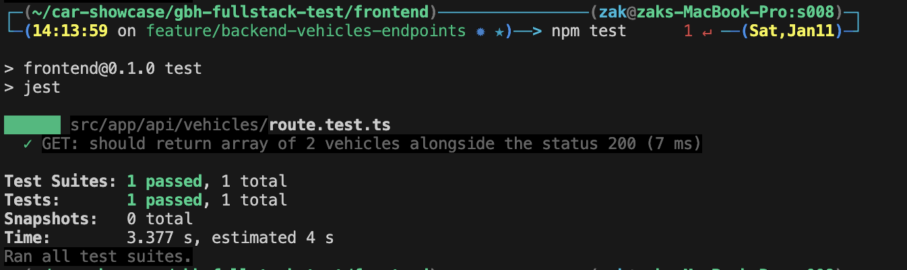

# Presentation : Full-Stack Next.js project (less than 5 hours)

1. Technical stack choices
   1. Due to lack of time and experience i am going to using NextJS only for the frontend and the backend, `Nest.js` is a great option but i need to train myself first.
2. Architecture decisions
   1. For the api/backend, using next.js api routes is quite simple and straight forward. Of course Next.js provide middlewares. Also we can create validators, controllers in addition to services and tests but for the moment i am going to keep it as simple as **possible** in order to get the job done within the following 4-5 hours.
   2. For the Frontend, using component-based architecture is paramount in addition to defining types, also using next.js SSR is mandatory to work on the SEO to enhance the app pages visibility on the search engines, as a result i am going to use SSR fetching and metadata.
3. State management approach
   1. For the moment let's just use Props to pass data but maybe later we will use Zustand.
4. Data fetching strategy
   1. For the moment, using Fetch method is quite adapted to what we want to do. but i recommend using React Query because of its potential to avoid refetching data while navigating.
5. Performance considerations
   1. I am going to try not to use useState and useEffect heavily, because most of the performance issues stem from the bad management of these two hooks.
6. Testing strategy
   1. Testing using insomnia/postman and jest for the api. (maybe i will include test for the frontend as well)
7. Potential improvements

   1. Create fetching functions for the frontend like "getVehicles" & "getVehicleById" instead of using fetch() directly inside the pages and components.
   2. Fetch the manufacturers, and types... from the api in order to use them in the filter.
   3. Implement a Database instead of using json file.
   4. Testing (automated) the frontend components as well.
   5. Enhance the security.
   6. and more...

8. Scalability considerations
   1. the frontend follows the rule/design_pattern "one responsibility component" which is robust way to avoid "spaghetti code" and insure a scalable code.
   2. the backend as well has a well organized structure.

## API Tests (ts-jest)

- i am mainly using Jest and insomnia to launch test requests in order to verify if the endpoints are working fine. you can test that using the following command `npm test`
  

## What i've created so far

Backend/API :

- Endpoints
  - GET `/vehicles` : fetch vehicles based on search params/queries
    - Filter by : year, manufacturer, type
    - Sort by : year, price
  - GET `/vehicles/[id]` : fetch vehicle by id
- Test
  - GET `/vehicles`
  - GET `/vehicles/[id]`

## Frontend/API :

- Components : `VehicleCard.tsx` `VehiclesList.tsx` `VehicleFilter.tsx` `LoadingVehiclesList.tsx` `VehicleDetails.tsx` `Pagination.tsx` `Hero.tsx` `Navbar.tsx ` `Footer.tsx`
- Pages : `Home page`, `vehicles page`
- Specials : `loading.tsx`, `errors.tsx`, `not-found.tsx`

# GBH Technical Test

## Context

This technical test simulates a real-world development environment where you'll be working as part of a team of 5 developers. We expect you to follow standard team development practices including proper git workflow, clear documentation, and maintainable code. Your work should reflect how you would contribute to a shared codebase.

## Objective

Create a vehicle showcase application using Next.js and a backend of your choice (NestJS or Next.js API Routes). The application should display a list of vehicles with filtering and sorting capabilities.

You can either:

- Use the provided mock data
- Implement your own backend with the provided data structure

## Required Features

- Responsive design (mobile, tablet, desktop)
- Display a paginated vehicle list
- Filter vehicles by manufacturer, type, and year
- Sort vehicles by price and year
- Display detailed vehicle information
- Implement proper git workflow (feature branches, clear commits, PRs)

## Data Structure

```typescript
interface Vehicle {
  id: string;
  manufacturer: string; // e.g., "BMW", "Tesla", "Toyota"
  model: string; // e.g., "X5", "Model 3", "Camry"
  year: number;
  type: VehicleType;
  price: number;
  fuelType: string;
  transmission: string;
  mileage?: number;
  features: string[];
  images: string[];
  description: string;
  createdAt: Date;
  updatedAt: Date;
}

enum VehicleType {
  SUV = "SUV",
  SEDAN = "SEDAN",
  TRUCK = "TRUCK",
  SPORTS = "SPORTS",
  LUXURY = "LUXURY",
  ELECTRIC = "ELECTRIC",
}

enum FuelType {
  GASOLINE = "GASOLINE",
  DIESEL = "DIESEL",
  ELECTRIC = "ELECTRIC",
  HYBRID = "HYBRID",
  PLUGIN_HYBRID = "PLUGIN_HYBRID",
}
```

## Evaluation Criteria

### Technical Presentation (50%)

The most important part of the evaluation will be a video call where you'll present:

- Your technical choices and their justification
- Architecture decisions
- Code organization
- Challenges encountered and solutions
- Potential improvements and scalability
- Live demonstration of the application

### Code Quality (30%)

- Clean and maintainable code
- TypeScript usage
- Component organization
- Error handling
- Testing approach
- Responsive design implementation

### Development Practices (20%)

- Git workflow
- Documentation
- Code organization
- Commit clarity

## Timeline

- Expected time: 4-6 hours
- Technical presentation: 20 minutes + 10 minutes Q&A

## Presentation Guidelines

Prepare to discuss:

1. Technical stack choices
2. Architecture decisions
3. State management approach
4. Data fetching strategy
5. Performance considerations
6. Testing strategy
7. Potential improvements
8. Scalability considerations

Good luck! 🚀
